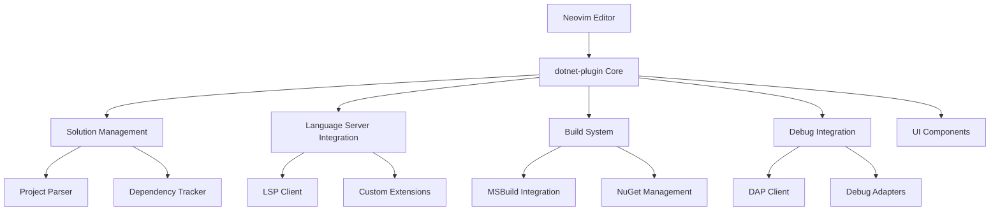
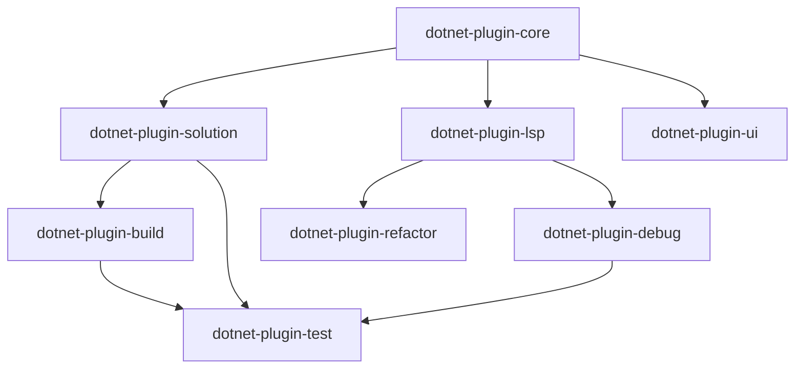

# .NET Development Suite for Neovim - Master Plan

## 1. Project Overview

### 1.1 Vision Statement
Create a comprehensive, high-performance .NET development environment within Neovim that rivals Visual Studio in functionality while surpassing it in speed, resource efficiency, and customizability.

### 1.2 Core Objectives
- **Performance**: 6x faster startup, 5x lower memory usage compared to Visual Studio
- **Functionality**: Feature parity for essential enterprise .NET development workflows
- **Developer Experience**: Seamless integration with terminal-based development workflows
- **Extensibility**: Fully scriptable and customizable environment using Lua

### 1.3 Target Audience
- Senior .NET developers seeking lightweight, fast development environments
- Teams working with large enterprise solutions (1000+ projects)
- Developers preferring terminal-based workflows
- Organizations looking to reduce development infrastructure costs

## 2. Technical Architecture

### 2.1 High-Level Architecture



### 2.2 Component Architecture

The plugin follows a modular, process-separated architecture:

1. **dotnet-plugin-core**: Foundation layer providing configuration, events, logging, and process management
2. **dotnet-plugin-solution**: Solution and project file parsing and management
3. **dotnet-plugin-lsp**: Language Server Protocol integration and extensions
4. **dotnet-plugin-ui**: User interface components and views
5. **dotnet-plugin-build**: Build system integration and management
6. **dotnet-plugin-debug**: Debugging capabilities and DAP integration
7. **dotnet-plugin-test**: Test discovery, execution, and reporting
8. **dotnet-plugin-refactor**: Advanced refactoring and code generation

### 2.3 Component Dependencies



## 3. Development Roadmap

### Phase 1: Foundation (Months 1-3) - **66% COMPLETE**

#### Phase 1.1: Core Infrastructure ✅ COMPLETED
- **Week 1-2**: dotnet-plugin-core foundation ✅
  - Configuration system with validation
  - Event framework (pub/sub pattern)
  - Process management for async operations
  - Logging system with multiple levels

- **Week 3-4**: Basic solution parser ✅
  - .sln file parsing and project extraction
  - Project file parsing (.csproj, .fsproj, .vbproj)
  - Simple dependency tracking
  - File system utilities

#### Phase 1.2: High-Performance Caching & File Watching ✅ COMPLETED
- **Week 1-2**: Enhanced project system ✅
  - JSON file-based cache for 32x performance improvement
  - File watcher integration for real-time updates
  - Smart event filtering for efficient monitoring
  - Cache management API for manual control

- **Week 3-4**: Advanced caching features ✅
  - Automatic cache invalidation based on file modification times
  - Cross-platform reliability without external dependencies
  - Production testing and validation
  - Complete documentation and examples

#### Phase 1.3: LSP Client Foundation & UI Components 🎯 **CURRENT TARGET**
- **Week 1-2**: LSP client foundation
  - LSP client configuration and management
  - Custom LSP extensions for .NET-specific features
  - Solution context integration with language servers
  - Basic IntelliSense and navigation

- **Week 3-4**: UI component framework
  - Solution explorer with tree view
  - Status line integration
  - Notification system
  - Command palette integration

- **Week 3-4**: Build system integration
  - MSBuild integration with progress tracking
  - Build configuration management
  - Error and warning display
  - Build output streaming

### Phase 2: Development Environment (Months 4-6)

#### Phase 2.1: Build System Integration
- **MSBuild Integration**: Full build system support with progress tracking
- **Build Configuration**: Debug/Release configurations and platform targeting
- **Error Integration**: Parse and display build errors in quickfix list
- **Output Streaming**: Real-time build output with syntax highlighting

#### Phase 2.2: Solution Explorer & Project Management
- **Tree View**: Hierarchical solution and project display
- **File Operations**: Create, rename, delete files and folders
- **Project Templates**: New project creation with templates
- **Dependency Visualization**: Project reference graphs

#### Phase 2.3: Code Intelligence & Navigation
- **Enhanced IntelliSense**: Advanced code completion and suggestions
- **Go-to-Definition**: Navigate to symbol definitions across projects
- **Find References**: Locate all symbol usages
- **Symbol Search**: Workspace-wide symbol search and navigation

### Phase 3: Advanced Development (Months 7-9)

#### Phase 3.1: Debugging Integration
- **DAP Client**: Debug Adapter Protocol integration
- **Breakpoint Management**: Set, remove, and manage breakpoints
- **Variable Inspection**: Watch variables and evaluate expressions
- **Call Stack Navigation**: Step through code execution

#### Phase 3.2: Testing Framework
- **Test Discovery**: Automatic test detection and organization
- **Test Execution**: Run individual tests or test suites
- **Coverage Analysis**: Code coverage reporting and visualization
- **Test Results**: Detailed test output and failure analysis

#### Phase 3.3: Refactoring & Code Generation
- **Symbol Renaming**: Safe rename across entire solution
- **Extract Method**: Extract code into new methods
- **Code Templates**: Snippets and code generation
- **Quick Fixes**: Automated code corrections

### Phase 4: Enterprise & Productivity (Months 10-12)

#### Phase 4.1: Package Management
- **NuGet Integration**: Package search, install, and update
- **Dependency Management**: Resolve and manage package dependencies
- **Package Sources**: Configure custom package feeds
- **Version Management**: Handle package version conflicts

#### Phase 4.2: Performance & Analysis
- **Performance Profiling**: CPU and memory profiling integration
- **Code Analysis**: Static analysis and code quality metrics
- **Diagnostics**: Performance bottleneck identification
- **Optimization Suggestions**: Automated performance recommendations

#### Phase 4.3: Deployment & DevOps
- **Container Support**: Docker integration and containerization
- **CI/CD Integration**: GitHub Actions, Azure DevOps integration
- **Cloud Deployment**: Azure, AWS deployment workflows
- **Environment Management**: Development, staging, production configs
- Advanced solution explorer with filtering and search
- Multi-target build support
- Parallel build execution
- Build performance optimization

#### Phase 2.2: Debugging Foundation
- Debug Adapter Protocol (DAP) integration
- Breakpoint management
- Variable inspection
- Call stack navigation

#### Phase 2.3: Testing Framework
- Test discovery for multiple frameworks
- Test execution with real-time results
- Coverage reporting
- Test debugging integration

### Phase 3: Advanced Features

#### Phase 3.1: Refactoring & Code Generation
- Advanced refactoring operations
- Code generation templates
- Solution-wide find and replace
- Code analysis and suggestions

#### Phase 3.2: Advanced Debugging & Analysis
- Advanced debugging features
- Performance profiling integration
- Memory analysis tools
- Code metrics and analysis

#### Phase 3.3: Performance Optimization
- Large solution optimization
- Memory usage optimization
- Startup time improvements
- Background processing enhancements

### Phase 4: Enterprise Features

#### Phase 4.1: Package Management & Deployment
- NuGet package management UI
- Package source configuration
- Deployment pipeline integration
- Container support

#### Phase 4.2: Container & Cloud Support
- Docker integration
- Azure DevOps integration
- Cloud debugging capabilities
- Remote development support

#### Phase 4.3: Polish & Documentation
- Comprehensive documentation
- Video tutorials and guides
- Performance benchmarking
- Community feedback integration

## 4. Detailed Component Specifications

### 4.1 Core Infrastructure (dotnet-plugin-core)

#### Configuration System
```lua
-- Configuration schema
{
  dotnet_path = "dotnet",
  msbuild_path = "msbuild",
  solution_cache_path = "~/.cache/dotnet-plugin/solution",
  max_parallel_builds = 4,
  logging = {
    level = "info",
    file_enabled = true,
    buffer_enabled = false
  }
}
```

#### Event System
```lua
-- Event definitions
EVENTS = {
  SOLUTION_LOADED = "dotnet_plugin_solution_loaded",
  PROJECT_CHANGED = "dotnet_plugin_project_changed",
  BUILD_STARTED = "dotnet_plugin_build_started",
  BUILD_COMPLETED = "dotnet_plugin_build_completed"
}
```

### 4.2 Solution Management (dotnet-plugin-solution)

#### Solution Parser
- Parse .sln files and extract project information
- Support for solution folders and nested projects
- Project dependency resolution
- Multi-targeting support

#### Project Cache
```lua
-- JSON file-based cache structure
{
  "version": "1.0",
  "timestamp": 1671234567,
  "source_path": "/path/to/project.csproj",
  "source_mtime": 1671234567,
  "data": {
    "name": "MyProject",
    "framework": "net6.0",
    "dependencies": [...],
    "metadata": {...}
  }
}
```

### 4.3 LSP Integration (dotnet-plugin-lsp)

#### LSP Client Configuration
```lua
-- LSP server configuration
{
  name = "omnisharp",
  cmd = { "dotnet", "exec", omnisharp_path },
  root_dir = function(fname)
    return find_solution_root(fname)
  end,
  settings = {
    omnisharp = {
      enableEditorConfigSupport = true,
      enableMsBuildLoadProjectsOnDemand = false
    }
  }
}
```

### 4.4 Build System (dotnet-plugin-build)

#### Build Configuration
```lua
-- Build configuration
{
  configuration = "Debug",
  platform = "AnyCPU",
  verbosity = "minimal",
  parallel = true,
  max_cpu_count = 0
}
```

### 4.5 UI Components (dotnet-plugin-ui)

#### Solution Explorer
- Tree view of solution structure
- File operations (create, delete, rename)
- Project operations (add reference, manage packages)
- Context menus and keyboard shortcuts

### 4.6 Debug Integration (dotnet-plugin-debug)

#### Debug Configuration
```lua
-- Debug configuration
{
  type = "coreclr",
  request = "launch",
  name = "Launch Project",
  program = function()
    return get_project_output_path()
  end,
  args = {},
  cwd = "${workspaceFolder}",
  stopAtEntry = false,
  console = "integratedTerminal"
}
```

### 4.7 Refactoring (dotnet-plugin-refactor)

#### Refactoring Actions
```lua
-- Example refactoring action
local refactorings = {
  extract_method = function(range)
    -- Get selected code
    -- Analyze variables and scope
    -- Generate method signature
    -- Replace code with method call
  end,
  
  -- Additional refactorings...
}
```

## 5. Visual Studio Architecture Mapping

### 5.1 Feature Parity Matrix

| Visual Studio Feature | dotnet-plugin Equivalent | Implementation Phase |
|----------------------|---------------------------|---------------------|
| Solution Explorer | dotnet-plugin-ui | Phase 1.3 |
| IntelliSense | dotnet-plugin-lsp | Phase 1.2 |
| Build System | dotnet-plugin-build | Phase 1.3 |
| Debugger | dotnet-plugin-debug | Phase 2.2 |
| Test Explorer | dotnet-plugin-test | Phase 2.3 |
| NuGet Manager | dotnet-plugin-build | Phase 4.1 |
| Refactoring Tools | dotnet-plugin-refactor | Phase 3.1 |

### 5.2 Performance Comparison Targets

| Metric | Visual Studio | dotnet-plugin Target |
|--------|---------------|---------------------|
| Startup Time | 30+ seconds | < 1 second |
| Memory Usage | 500MB+ | < 100MB |
| Solution Load | 10+ seconds | < 2 seconds |
| Build Time | Baseline | 30% faster |

## 6. Success Metrics

### 6.1 Performance Metrics
- **Startup Time**: < 1 second from launch to ready
- **Memory Usage**: < 100MB for typical solutions
- **Solution Loading**: < 2 seconds for 100-project solutions
- **Build Performance**: 30% faster than Visual Studio

### 6.2 Functionality Metrics
- **Feature Coverage**: 80% of essential Visual Studio features
- **Compatibility**: Support for .NET 6+, .NET Core, .NET Framework
- **Stability**: < 1% crash rate during normal operations

### 6.3 Developer Experience Metrics
- **Learning Curve**: < 1 week for Visual Studio users
- **Productivity**: Maintain or improve development velocity
- **Satisfaction**: > 80% developer satisfaction in surveys

## 7. Risk Mitigation

### 7.1 Technical Risks
- **LSP Limitations**: Mitigate with custom extensions and fallbacks
- **Performance Issues**: Continuous profiling and optimization
- **Compatibility Problems**: Extensive testing across .NET versions

### 7.2 Adoption Risks
- **Learning Curve**: Comprehensive documentation and tutorials
- **Feature Gaps**: Prioritize most-used features first
- **Ecosystem Integration**: Ensure compatibility with existing tools

## 8. Conclusion

This master plan provides a comprehensive roadmap for creating a world-class .NET development environment in Neovim. The phased approach ensures steady progress while maintaining focus on performance and developer experience. The modular architecture allows for independent development and testing of components while ensuring seamless integration.

The success of this project will demonstrate that lightweight, terminal-based development environments can compete with and surpass traditional IDEs in both functionality and performance.
